<p align="center">
  
</p>

<p align="center">
  <strong>Un loup-garou grandeur nature, mené par une application.</strong><br>
  Pas de cartes physiques, pas de maître du jeu : l'application distribue les rôles, mène les nuits, compte les morts et proclame le vainqueur.
</p>

---

## 🌙 Le jeu

Un village est hanté par des loups-garous. Chaque nuit, ils dévorent un villageois ; à chaque conseil, le village vote pour éliminer un suspect. Les villageois gagnent s'ils débusquent tous les loups, les loups gagnent s'ils deviennent plus nombreux que les autres (ou aussi nombreux, si l'un d'eux est maire).

Le jeu se vit **grandeur nature**, sur plusieurs heures ou plusieurs jours : l'application gère les rôles, les nuits et les votes, mais l'essentiel se passe entre les joueurs.

- **Le rythme des conseils est libre** : les joueurs conviennent ensemble de leur fréquence (tous les jours, toutes les 12 h, toutes les 6 h…). L'application lance un conseil quand le groupe le décide.
- **Le jeu se joue en dehors des conseils** : on discute, on forme des alliances, on cherche à démasquer les loups.
- **Les morts deviennent des esprits frappeurs** : ils continuent de discuter avec les autres et de glaner des informations, mais ne votent pas et ne parlent pas au conseil.
- **Les esprits ne vont jamais vers les vivants** pour parler du jeu : ce sont les vivants qui viennent les interroger.

À chaque tour de nuit, l'application demande de passer l'appareil au joueur concerné, en deux étapes, pour que personne ne voie la carte d'un autre.

### Une partie en un coup d'œil

1. **Composition** : on saisit les pseudos et on règle le nombre de loups et de rôles spéciaux. Le reste de la table est complété en villageois.
2. **La nuit tombe** : chaque joueur, à son tour, découvre sa carte et agit en secret (dévorer, sonder, protéger, soigner…).
3. **Le village se réveille** : un panneau d'affichage annonce les morts de la nuit et le camp qu'ils avaient.
4. **Élection du maire** (au premier jour) puis **conseil du village** : on débat, l'app enregistre le vote et révèle si l'éliminé était loup ou non.
5. Retour à la nuit, jusqu'à la victoire d'un camp.

## 🃏 Les rôles

| | Rôle | Camp | Pouvoir |
|---|---|---|---|
| 🐺 | **Loup-Garou** | Loups | Se retrouve avec la meute et vote chaque nuit (dès la deuxième) pour dévorer un villageois. |
| 🧑‍🌾 | **Villageois** | Village | Aucun pouvoir : il dort, débat et vote le jour. |
| 🔮 | **Voyante** | Village | Une nuit sur deux par défaut, sonde un joueur et découvre son rôle. |
| 🧪 | **Sorcière** | Village | Dispose de potions de soin (une par défaut) pour sauver la victime des loups, sans savoir qui a été désigné : elle choisit à l'aveugle de l'utiliser ou non. En option, elle a aussi des potions de mort pour empoisonner un joueur (ni le salvateur ni le soin ne l'en protègent). |
| 🏹 | **Cupidon** | Village | La première nuit, lie deux joueurs par l'amour (lui compris). |
| 🔫 | **Chasseur** | Village | À sa mort, tire une dernière balle sur le joueur de son choix. |
| 🛡️ | **Salvateur** | Village | Protège un joueur chaque nuit, jamais le même deux nuits de suite. |
| 🧒 | **Enfant sauvage** | Village | Choisit un mentor ; si celui-ci meurt, il devient loup-garou. |
| 🃏 | **Voleur** | Village | Deux cartes restent au milieu de la table : il peut prendre le rôle de l'une d'elles. |
| 🦊 | **Renard** | Village | Dès la deuxième nuit, flaire trois joueurs et apprend si un loup s'y cache ; sans loup, il perd son flair. |
| 🌕 | **Loup Blanc** | Loups, solitaire | Une nuit sur deux, peut dévorer l'un de ses frères ; il gagne seul. |
| 🐕 | **Chien-Loup** | Au choix | Choisit son camp en secret la première nuit : villageois ou loup-garou. |
| 🐶 | **Louveteau** | Loups | Loup comme les autres ; s'il meurt, la meute dévore deux victimes la nuit suivante. |
| 👭 | **Sœurs** (2 cartes) | Village | Elles se connaissent dès la première nuit. |
| 👬 | **Frères** (3 cartes) | Village | Ils se connaissent dès la première nuit. |
| 🧹 | **Servante dévouée** | Village | La nuit qui suit un vote, elle peut reprendre en secret le rôle du condamné ; le panneau d'affichage annonce le lendemain qu'elle est intervenue. |
| 🐻 | **Montreur d'ours** | Village | Chaque matin, son ours grogne si l'un de ses deux voisins vivants (autour de la table, dans l'ordre des noms saisis) est un loup. |
| 👧 | **Petite Fille** | Village | Elle joue après les loups : elle peut les espionner (une chance sur trois d'être dévorée) et apprend qui ils ont désigné, plus deux silhouettes dont l'une est un loup. |
| 🐦 | **Corbeau** | Village | Chaque nuit, désigne un joueur qui recevra deux voix de plus au prochain vote (annoncé au panneau). |
| 🤡 | **Idiot du village** | Village | Condamné par le village, il révèle son rôle et survit (une fois), mais ne vote plus. |
| 🐐 | **Bouc émissaire** | Village | En cas d'égalité des voix, c'est lui qui est condamné (bouton « Égalité des voix » au vote). |
| ⚖️ | **Juge bègue** | Village | Une fois par partie, exige (de nuit, en secret) un second vote du village au conseil suivant. |

## 📜 Les règles gérées par l'app

- **Première nuit sans mort** : les loups se découvrent, mais personne n'est dévoré, et il n'y a pas de vote le premier jour.
- **Le maire** est élu au premier jour ; s'il meurt, il choisit lui-même son successeur.
- **Égalité loups / villageois** : la partie continue tant que le maire n'est pas un loup ; elle s'arrête dès que les loups sont plus nombreux, ou aussi nombreux avec un loup pour maire.
- **Loups en désaccord** : si les loups ne se mettent pas d'accord sur une victime, personne n'est dévoré cette nuit-là. Les loups peuvent désigner n'importe quel autre joueur vivant, y compris l'un des leurs.
- **Couple tiré au sort** : Cupidon est remplacé par un villageois (la case est grisée et le dit) ; la Voyante peut alors, une fois, découvrir le couple au lieu de sonder un rôle.
- **Les amoureux** (Cupidon, ou tirés au sort si l'option est activée) apprennent leur amour par une fenêtre « Vous êtes en couple » la première fois qu'ils se réveillent, puis meurent ensemble et gagnent s'ils sont les derniers survivants (deux, ou trois en mode trouple). Si le couple mêle un loup et un villageois, il forme un camp à part : tant qu'il vit, ni le village ni la meute ne peuvent gagner, et le couple doit éliminer tous les autres.
- **La meute** : chaque loup découvre ses complices dans une fenêtre « Vous êtes la meute » (ou « Tu es le dernier loup ») la première fois qu'il joue ; si la fenêtre du couple doit s'ouvrir à ce tour, celle de la meute attend la nuit suivante.
- **Le chasseur** peut emporter quelqu'un avec lui en mourant, ou renoncer à tirer.
- **Les solitaires** (Loup Blanc) ne gagnent qu'en éliminant tout le monde : tant qu'ils vivent, ni le village ni la meute ne peut conclure.
- **Camp secret** : à la mort du Chien-Loup, son camp n'est pas dévoilé avant la fin de la partie.
- **Louveteau** : sa mort double les victimes des loups la nuit suivante. La meute désigne alors deux joueurs ; en cas d'égalité à la limite des deux, seuls les joueurs strictement plus désignés meurent. La potion de la sorcière ne sauve que la victime la plus désignée.
- **Servante dévouée** : la nuit qui suit un vote, elle choisit (ou non) de reprendre le rôle d'un joueur condamné la veille ; elle découvre sa nouvelle carte tout de suite et la joue dès la nuit suivante. Le panneau du lendemain annonce que la servante a pris le rôle du condamné, sans donner son nom ni dire quel rôle elle a pris. Le camp du condamné a été révélé normalement au vote.
- **Juge bègue** : adaptation à l'app, il active son pouvoir pendant son tour de nuit (le second vote suit immédiatement le premier au conseil du lendemain, sauf si la partie est déjà finie ou s'il reste un tir de chasseur à résoudre).
- **Ordre de nuit** : le Voleur agit avant tout le monde, puis le Chien-Loup, puis les autres rôles.

## ✨ Fonctionnalités

- **Reprise visible** : quand une partie est sauvegardée, l'accueil la résume (nuit ou conseil, joueurs en vie, date) et propose « Reprendre la partie » ; « Nouvelle partie » demande confirmation avant de la remplacer.
- **Menu d'accueil** : un village qui défile (jour, nuit, loups, victoire) avec deux boutons, « Nouvelle partie » et « Historique ». L'écran Historique affiche chaque partie archivée sous forme de carte (date, joueurs, rôles, camp vainqueur, bordure colorée selon le vainqueur) avec le journal détaillé en cases nuit/jour.
- **Documentation** : depuis le menu d'accueil, un onglet « Les rôles » avec une dalle par rôle (résumé, force loups / village, information, chaos) et un onglet « Comment jouer » (principe, déroulement, victoire, maire, passage de l'appareil).
- **Rappel des règles en partie** : un volet de la barre latérale rappelle le déroulement, les conditions de victoire et les rôles du paquet.
- **Bilan de fin de partie** : chiffres clés (nuits, morts, loups démasqués, innocents condamnés...), distinctions (première victime, erreur judiciaire, loup le plus discret...), frise des disparitions, puis « Rejouer avec les mêmes joueurs » ou retour au menu.
- **Préférences durables** : les noms des joueurs (`joueurs.json`), les réglages du son et la dernière composition (`preferences.json`) sont gardés d'une session à l'autre ; ces fichiers sont ignorés par git. Une fois le son activé, il le reste jusqu'à ce qu'on le coupe.
- **Cartes de rôle illustrées** : chaque rôle a son illustration vectorielle (icônes game-icons.net, voir les crédits), sur la carte de nuit, les bulles de la composition et la page Documentation.
- **Musiques et bruitages** : trois musiques libres de droits (CC0, FreePD) de plus de deux minutes (nuit inquiétante « Creepy Hallow », jour sobre « Nostalgic Piano », conseil tendu « Find Them », qui démarre dès le réveil quand la nuit a fait des morts), un coup de gong grave quand un innocent meurt (au réveil ou au verdict du village), un hurlement de loup quand un joueur découvre qu'il est loup et à la victoire des loups, une ovation à la victoire du village ; les bruitages sont synthétisés par un script. **Le son est désactivé par défaut** : trois cases du menu Option de la barre latérale (musique, bruitages, hurlement) l'activent, et le hurlement trahit le camp du joueur à ceux qui l'entendent. Un fichier `musique.mp3` posé à la racine remplace les musiques. Le navigateur ne démarre un son qu'après un premier clic dans la page.
- **Retournement de carte** : à la révélation, le dos de la carte se retourne pour montrer le rôle (désactivé si le système demande de réduire les animations).
- **Statistiques** : l'écran Historique a un onglet « Statistiques » : victoires par camp, victoire du village selon la taille de la table, taux de victoire et de survie de chaque rôle, calculés sur les parties archivées.
- **Identité** : logo (loup hurlant) sur l'accueil, icône d'onglet, dos de carte au loup.
- **Composition en quatre étapes** (Table, Rôles, Options, Joueurs) avec un bandeau fixe en bas (retour, équilibre du moment, étape suivante) : compteurs à boutons ronds, rôles rangés par catégorie, réglages en boutons. La dernière composition jouée est reproposée à la partie suivante.
- **Jauges d'équilibre** : l'écran de composition affiche, centrée au-dessus des icônes de rôles, la chance de victoire du village en % (curseur loups / village), un niveau d'information et un niveau de chaos, recalculés à chaque changement de rôle ou d'option. Les coefficients sont mesurés par simulation de parties automatiques (méthode, résultats et limites dans `docs/equilibre-roles.md`).
- **Réglages de la partie** (étape « Options » de la composition), en cartes centrées : potions de soin et de mort de la sorcière (0 à 5 chacune), fréquence des visions de la voyante et des festins du Loup Blanc (chaque nuit, une nuit sur 2 ou sur 3), couple tiré au sort sans Cupidon (Cupidon est alors remplacé par un villageois), BONUS : la voyante peut-elle découvrir ce couple, mode fun « trouple » (l'amour lie trois joueurs, proposé même sans couple tiré au sort), égalité loups / village (le maire départage, ou les loups gagnent dès l'égalité), ce que révèle une mort (le camp, le rôle ou rien), composition secrète (le rappel des règles ne liste pas les rôles du paquet), la sorcière qui apprend qui elle a sauvé la nuit suivante, et une échéance de conseil tirée au hasard chaque jour entre deux bornes (de 15 min à 24 h) avec compte à rebours. Tous les réglages sont décrits dans l'onglet « Les options » de la documentation. Les réglages qui n'ont pas de sens dans la partie (rôle absent, couple non tiré au sort) ne sont pas affichés.
- **Écrans de passage sécurisés** entre chaque joueur pour éviter qu'un rôle soit vu par la mauvaise personne.
- **Rechargement d'étape** : le menu Option de la barre latérale permet de revenir au début d'une nuit ou à l'annonce d'un jour (plantage, erreur de clic).
- **Historique de partie** : chaque action (votes des loups, visions, protections, morts, tirs, élection du maire…) est journalisée, affichée nuit par nuit à la fin, archivée à la fin de la partie dans `historique/partie_AAAAMMJJ_HHMMSS.json` (les parties abandonnées ne sont pas conservées) et téléchargeable en JSON.
- **Sauvegarde automatique** (`save.json`) : la partie reprend là où elle s'est arrêtée, même après avoir fermé le serveur. La sauvegarde est versionnée et mise à niveau à la lecture (une partie commencée avec une ancienne version reste jouable), écrite sans risque de fichier tronqué, et un fichier illisible est mis de côté (`save.json.corrompue`...) au lieu de faire planter l'application.
- **Abandon confirmé** : abandonner une partie en cours demande une confirmation.

<p align="center">
  
</p>

---

# 🛠️ Partie technique

## Prérequis

- macOS avec Python 3.10 ou supérieur (Python 3.9 ou antérieur peut poser des problèmes d'installation de dépendances).
- Le Terminal.
- Une connexion Internet au premier lancement (pour charger les polices Google Fonts utilisées par les cartes).

## Installation et lancement

### Option 1 : avec uv (le plus rapide)

```bash
# Installe uv si ce n'est pas déjà fait
brew install uv

# Lance directement l'app (uv installe Streamlit et le bon Python à la volée)
uv run --python 3.12 --with streamlit streamlit run src/loup_garou_app.py
```

Une seule commande, à chaque fois : pas de venv à créer ni à activer.

### Option 2 : avec venv + pip (méthode classique)

```bash
# Vérifie ta version de Python (3.10+ recommandé)
python3 --version

# Si besoin, installe une version récente via Homebrew
brew install python@3.12

# Crée et active un environnement virtuel
python3 -m venv .venv
source .venv/bin/activate

# Installe les dépendances
pip install --upgrade pip
pip install streamlit

# Lance l'app
streamlit run src/loup_garou_app.py
```

**À chaque nouvelle session**, réactive l'environnement virtuel avant de relancer :

```bash
source .venv/bin/activate
streamlit run src/loup_garou_app.py
```

---

Dans les deux cas, ton navigateur s'ouvre automatiquement sur `http://localhost:8501`. Pour arrêter le serveur : `Ctrl+C` dans le terminal.

## Structure du projet

```
.
├── src/
│   ├── loup_garou_app.py        # Point d'entrée Streamlit (quelques lignes)
│   └── loup_garou/
│       ├── app.py               # main() : page, barre latérale, aiguillage selon la phase
│       ├── assets/              # Illustrations SVG des rôles, bruitages WAV, favicon, CREDITS.md
│       ├── config.py            # Chemins (save.json, historique/, musique.mp3)
│       ├── options.py           # Options avancées et leurs valeurs par défaut
│       ├── equilibre.py         # Jauges d'équilibre (chance du village, information, chaos), lit assets/equilibre.json
│       ├── roles.py             # Registre ROLES (données des rôles, sans interface)
│       ├── moteur/              # Règles du jeu, sans dépendance à l'interface
│       │   ├── partie.py        #   nouvelle partie, morts, résolution de la nuit, victoire
│       │   ├── bilan.py         #   bilan de fin de partie (chiffres, distinctions, frise)
│       │   ├── statistiques.py  #   statistiques sur les parties archivées
│       │   ├── journal.py       #   journal et instantanés de la chronologie
│       │   └── persistance.py   #   sauvegarde, archives et lecture de l'historique
│       └── ui/                  # Interface Streamlit
│           ├── styles.py        #   CSS et décors SVG
│           ├── composants.py    #   cartes, bandeaux, dalles de sélection...
│           ├── nuit_roles.py    #   tour de nuit de chaque rôle (NUIT_ROLES)
│           ├── regles.py        #   texte des règles (tutoriel et rappel en partie)
│           ├── barre_laterale.py#   rechargement d'étape, barre ouverte
│           └── ecrans/          #   accueil, installation, nuit, jour, fin, documentation
├── .claude/skills/projet-gevaudan/SKILL.md  # Guide du projet pour Claude Code (architecture, règles, conventions)
├── outils/                      # Génération des assets (icônes, sons, favicon) et simulation d'équilibre
├── docs/
│   ├── equilibre-roles.md       # Force, information et chaos de chaque rôle (proposition)
│   ├── banniere.svg             # Bannière de nuit du README
│   └── banniere-jour.svg        # Bannière de jour du README
├── musique.mp3                  # (optionnel) musique de fond, à ajouter toi-même
├── save.json                    # Sauvegarde de la partie en cours (générée automatiquement)
├── historique/                  # Archives JSON des parties terminées (versionnées dans le dépôt)
└── .streamlit/
    └── config.toml              # Configuration du thème sombre
```

Le dossier `moteur/` ne dépend ni de Streamlit ni de `ui/` : les règles se lisent et se testent sans interface. Les dépendances vont toujours dans le même sens : `ui` -> `moteur` -> `roles` / `options` -> `config`.

> 💡 `save.json` contient l'état complet d'une partie en cours, y compris les rôles des joueurs : il est listé dans le `.gitignore`. Le dossier `historique/`, lui, est poussé sur le dépôt : chaque partie terminée y ajoute un fichier avec les rôles et le journal complet.

## Tests

```bash
uv run --python 3.12 --with pytest --with streamlit python -m pytest
```

- `tests/test_partie.py`, `test_options.py`, `test_roles.py`, `test_journal.py`, `test_persistance.py` : tests unitaires du moteur, sans Streamlit. Chaque test tourne dans un dossier temporaire (`save.json` et `historique/` du dépôt ne sont jamais touchés).
- `tests/test_ui_smoke.py` : joue une partie complète au hasard (graine fixe) avec le banc d'essai `streamlit.testing`, pour repérer une exception d'affichage ou un écran sans issue. Il est ignoré si Streamlit n'est pas installé.
- La CI (`.gitlab-ci.yml` et `.github/workflows/tests.yml`) lance cette suite sur chaque merge request / pull request.

## Illustrations et sons

Les illustrations viennent de [game-icons.net](https://game-icons.net) (licence CC BY 3.0, auteurs Lorc et Delapouite) : la liste des crédits est dans `src/loup_garou/assets/CREDITS.md` et dans la page Documentation de l'app. Pour changer une icône, modifier `outils/importer_icones.py` puis le relancer :

```bash
python3 outils/importer_icones.py                                          # icônes des rôles
uv run --python 3.12 --with numpy --with lameenc python outils/importer_musiques.py   # musiques (CC0)
uv run --python 3.12 --with numpy python outils/generer_sons.py            # bruitages
uv run --python 3.12 --with numpy python outils/simuler_equilibre.py       # mesures d'équilibre (3 min)
uv run --python 3.12 --with cairosvg python outils/generer_favicon.py      # icône d'onglet
```

## Faire évoluer l'état de partie

Toute clé obligatoire ajoutée à l'état (`nouvelle_partie`) exige une migration dans `src/loup_garou/moteur/migrations.py` : incrémenter `VERSION`, ajouter une fonction à `MIGRATIONS` qui donne une valeur par défaut aux parties déjà sauvegardées. Sans cela, la reprise d'une ancienne sauvegarde plante. Voir aussi `docs/accessibilite.md` pour l'état de l'accessibilité.

## Ajouter un rôle

1. Déclarer le rôle dans le registre `ROLES` de `src/loup_garou/roles.py` (dataclass `Role`) : nom, emoji, dégradé de la carte, camp, état de départ, priorité de nuit, description (une ou deux phrases, affichées en infobulle dans l'écran de composition), sa catégorie (`categorie` : info, pouvoir, chaos ou loups), son illustration (une entrée dans `ICONES` de `outils/importer_icones.py`, puis relancer le script) et ses mesures d'équilibre (relancer `outils/simuler_equilibre.py`, qui réécrit `assets/equilibre.json` ; un test exige que chaque rôle y figure). Pour les jauges d'équilibre, ajouter aussi ses notes dans `src/loup_garou/equilibre.py`.
2. Écrire sa fonction de tour de nuit dans `src/loup_garou/ui/nuit_roles.py` et l'inscrire dans le dictionnaire `NUIT_ROLES`. Un rôle absent de `NUIT_ROLES` dort comme un villageois. Un rôle qui se joue à plusieurs cartes (Sœurs, Frères) renseigne `lot` : cocher la case en ajoute `lot` cartes.

Les règles (`moteur/`) lisent le registre : elles n'ont pas à changer pour un rôle sans effet particulier sur la victoire ou les morts.
